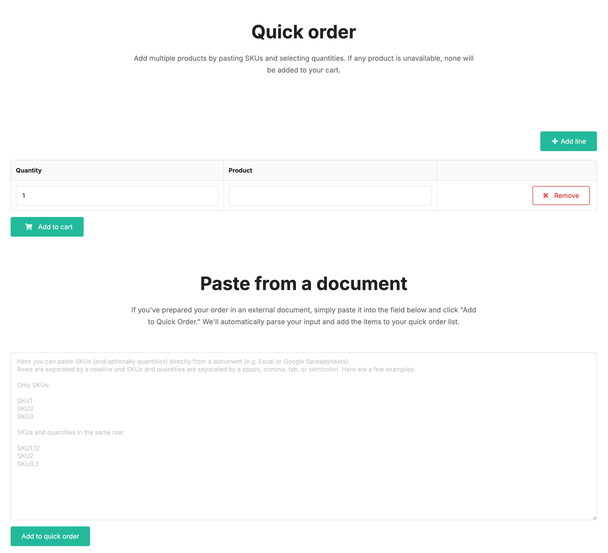

# Sylius Quick Order Plugin

[![Latest Version][ico-version]][link-packagist]
[![Software License][ico-license]](LICENSE)
[![Build Status][ico-github-actions]][link-github-actions]
[![Code Coverage][ico-code-coverage]][link-code-coverage]
[![Mutation testing][ico-infection]][link-infection]

Allow your customers to add products by SKU.



## Installation

```shell
composer require setono/sylius-quick-order-plugin
```

### Import routing

```yaml
# config/routes/setono_sylius_quick_order.yaml
setono_sylius_meilisearch:
    resource: "@SetonoSyliusQuickOrderPlugin/Resources/config/routes.yaml"
```

or if your app doesn't use locales:

```yaml
# config/routes/setono_sylius_meilisearch.yaml
setono_sylius_meilisearch:
    resource: "@SetonoSyliusQuickOrderPlugin/Resources/config/routes_no_locale.yaml"
```

### Install assets

```shell
php bin/console assets:install
```

## Usage

Go to https://your-store.com/en_US/quick-order

[ico-version]: https://poser.pugx.org/setono/sylius-quick-order-plugin/v/stable
[ico-license]: https://poser.pugx.org/setono/sylius-quick-order-plugin/license
[ico-github-actions]: https://github.com/Setono/sylius-quick-order-plugin/actions/workflows/build.yaml/badge.svg
[ico-code-coverage]: https://codecov.io/gh/Setono/sylius-quick-order-plugin/branch/master/graph/badge.svg
[ico-infection]: https://img.shields.io/endpoint?style=flat&url=https%3A%2F%2Fbadge-api.stryker-mutator.io%2Fgithub.com%2FSetono%2Fsylius-quick-order-plugin%2Fmaster

[link-packagist]: https://packagist.org/packages/setono/sylius-quick-order-plugin
[link-github-actions]: https://github.com/Setono/sylius-quick-order-plugin/actions
[link-code-coverage]: https://codecov.io/gh/Setono/sylius-quick-order-plugin
[link-infection]: https://dashboard.stryker-mutator.io/reports/github.com/Setono/sylius-quick-order-plugin/master
